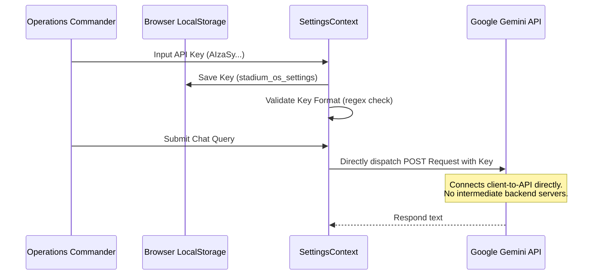

# Security Hardening Policy & Threat Model

This document outlines the security architecture, threat model, vulnerabilities, and mitigations implemented in **StadiumOS AI**.

---

## 🔐 1. Threat Model & Risk Analysis

The StadiumOS AI dashboard is a decentralized front-end web application that processes real-time telemetry and interfaces with large language models. The primary threat categories identified and defended against are:

| Threat Category | Potential Impact | Mitigations Implemented |
|:---|:---|:---|
| **API Key Leakage** | Unauthorized usage and financial cost on the user's Google Cloud/Gemini account. | Client-side only storage (`localStorage`), key redaction in logs/errors, and direct client-to-API communication. |
| **Cross-Site Scripting (XSS)** | Injection of malicious scripts via chatbot inputs, broadcast messages, or volunteer dispatch names. | Rigid input escaping/sanitization via `sanitizeInput` utility, React's native string interpolation protection, and strict CSP headers. |
| **HTML Injection** | Phishing or visual manipulation of the command center dashboard. | Input validation and escaping of all dynamic text nodes prior to rendering. |
| **Local Storage Corruption** | Malformed settings parsing crashing the application rendering pipeline. | Safe JSON parse exception boundaries inside the state providers. |

---

## 🔑 2. Secure Key Handling Architecture

### Key Principles Implemented:
1. **Direct client-to-API communication**: There is no middle-man backend server. The Gemini API key is dispatched directly from the user's browser to `generativelanguage.googleapis.com`.
2. **Local Storage only**: The key is stored in browser local storage (`stadium_os_settings`) and never sent to any logging service or central repository database.
3. **Format Validation**: The input field runs a regex match check `^AIzaSy[A-Za-z0-9_-]{33}$` to ensure only correctly formatted Google API keys are accepted.
4. **Secret Redaction**: Any error messages returned from the API are sanitized. Any occurrences of the key pattern `AIzaSy[A-Za-z0-9_-]{33}` in error logs are automatically redacted to `[REDACTED_API_KEY]`.

---

## 🛡️ 3. Input Sanitization & XSS Mitigation

All inputs typed by operations commanders (e.g. chat messages, volunteer tasks, emergency alerts) are sanitized:

* HTML special characters (`&`, `<`, `>`, `"`, `'`, `/`) are converted to standard HTML entities:
  - `<` → `&lt;`
  - `>` → `&gt;`
  - `"` → `&quot;`
  - `'` → `&#x27;`
  - `/` → `&#x2F;`
* This prevents browser parsing engines from interpreting strings as markup, neutralising XSS vectors.

---

## 🔒 4. Content Security Policy (CSP) & Security Headers

Next.js is configured with strict security headers (see [next.config.ts](file:///c:/Users/vivek/OneDrive/Desktop/prompt%20wars/stadium%20-%20A/next.config.ts)):

1. **Content-Security-Policy**:
   - `default-src 'self'`: Only allow scripts and resources from the same origin.
   - `connect-src 'self' https://generativelanguage.googleapis.com`: Lock network requests to origin and Gemini API endpoints.
   - `script-src 'self' 'unsafe-eval' 'unsafe-inline'`: Prevent third-party external script executions.
2. **X-Frame-Options: DENY**: Prevents Clickjacking attacks by forbidding the page to be embedded inside `<iframe>` tags.
3. **X-Content-Type-Options: nosniff**: Restricts browsers from MIME-sniffing away from declared content-types.
4. **Referrer-Policy: strict-origin-when-cross-origin**: Protects metadata leakages during navigation.
5. **Permissions-Policy**: Restricts unauthorized hardware access (camera, microphone, geolocation are disabled by default).
